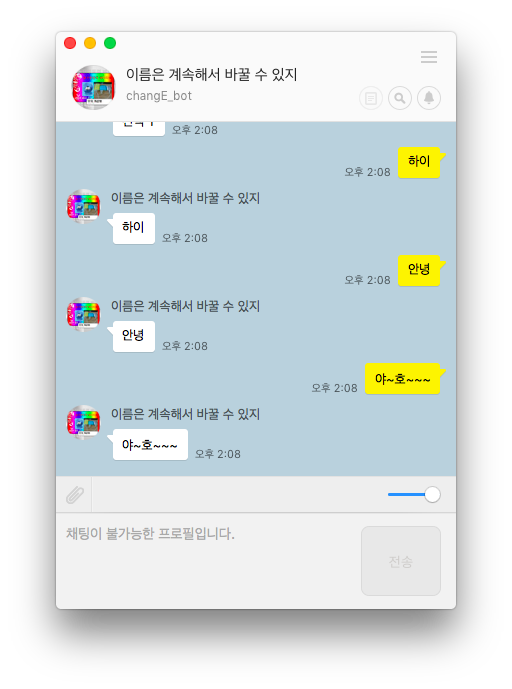

# 카카오톡 플러스 친구

### 0. 간단한 설명

- 지금까지 우리가 만들었던 레일즈 서버는 사용자가 URL을 통해서 요청이 들어오면 html문서를 응답해 주었습니다.


- 하지만 사용자가 아닌 서버가 요청을 할때는 데이터만 전송해주는게 효율적입니다.
  그래서 우리는 JSON을 사용해서 서버가 요청한 데이터를 응답해줍니다.


- 지금까지 우리가 사용한 컨트롤러는 다음과 같습니다.

```ruby
# GET /movies
# GET /movies.json
def index
  @movies = Movie.all
end
```

- 그런데 여기 index안에 생략된 부분이 있습니다.

  > Rails에서는 '설정보다 규약(CoC: convention over configuration)'를 권장한다는 것을 들어보셨을 겁니다. 기본 출력 결과는 CoC의 좋은 예시이기도 합니다. Rails 컨트롤러는 기본적으로 라우팅에 맞는 이름을 가지는 뷰를 자동적으로 선택하고, 그것을 사용해서 결과를 출력합니다.
  >
  > ```ruby
  > class BooksController < ApplicationController
  >   def index
  >     @books = Book.all
  >   end
  > end
  > ```
  >
  > 이 코드에서 주목해야하는 부분은 '설정보다 규약'이라는 원칙 덕분에 index 액션의 마지막 부분에서 명시적으로 랜더링을 지시할 필요가 없다는 점입니다. 여기에서의 원칙은 '컨트롤러의 액션의 마지막 부분에서 명시적인 랜더링 지시가 없을 경우에는 컨트롤러가 사용가능한 뷰 목록의 경로로부터 `action명.html.erb`이라는 뷰 템플릿을 찾고, 그것을 사용할 것'입니다. 따라서, 이 경우에는 `app/views/books/index.html.erb`을 사용해서 출력합니다.

```ruby
def index
  @movies = Movie.all
  render "index.html.erb" # 너무 당연해서 Rails에서 생략 가능한 문장입니다.
end
```

- 기본으로 html문서를 응답하는 Rails를 JSON으로 응답시켜주기 위해서는 다음과 같이 적어주면 됩니다.

```ruby
def index
  @movies = Movie.all
  render json: @movies
end
```

- 그 후 index를 요청해보면 다음과 같은 결과를 받을 수 있습니다.


- 여기서 플러스친구는 어떤 규칙을 가지고 있는지 알아봅시다. [플러스친구 자동응답 API](https://github.com/plusfriend/auto_reply)로 이동해서 API문서를 읽어봅시다.


### 1. 설정하기

- [카카오톡 플러스친구 관리자 센터](https://center-pf.kakao.com/)로 들어가 카카오톡 아이디로 로그인을 해주세요.
- 새 플러스 친구를 만들어 주세요.


- 개설 완료!

  

- 이렇게 정보를 작성하면 됩니다.


- 우리는 스마트채팅을 사용할 예정입니다


- 그 중에서 API형을 설정해주세요.


- 정보를 입력해주세요. 아직 우리는 서버를 만들지 않았으니 서버를 만들러 가보겠습니다.


### 2. 서버를 만들어봅시다.

- 우리는 레일즈를 사용해서 카카오톡 API서버를 만들 예정입니다.


- 컨트롤러를 만들어 줍니다. `rails g controller kakao keyboard message` 


- `app/controller/kakao_controller.rb` 
  위에서 실패했던 API테스트를 통과 하기 위해서 필수 조건인 키보드를 만들어 줍니다.

  ```ruby
  class KakaoController < ApplicationController
    def keyboard
      @keyboard = {
        :type => "buttons",						# 이렇게 작성해도
        buttons: ["선택 1", "선택 2", "선택 3"]		 # 요렇게 작성해도 똑같습니다.
      }
      render json: @keyboard
    end

    def message
    end
  end
  ```

- `config/routes.rb`
  플러스친구 API는 URL요청이 정해져 있으므로 라우팅을 해줍니다.

  ```ruby
  # 기본으로 설정되있던 
  # get 'kakao/keyboard'를 다음과 같이 바꾸어 줍니다.
  get '/keyboard' => 'kakao#keyboard'
  ```

- 플러스 친구가 요구하는 최소한의 조건을 만족했으니 API테스트를 해보겠습니다.
  테스트는 통과하였습니다. 추가적으로 인증을 마치고 저장을 합니다.


- 시작하기 버튼을 눌러 플러스친구 API형 채팅을 활성화 해봅시다.


- 카카오톡에서 검색이 가능하려면 한가지 더 설정을 해줘야 합니다.
  아래의 공개 설정을 활성화 합니다.


- 카카오톡에서 플러스친구 이름/아이디 로 검색을 해서 친구추가를 합니다.


- 채팅을 시작하면 우리가 만들었던 키보드를 확인 할 수 있습니다.


- 하지만 우리가 만든 플러스친구는 아직 대답을 할 수 없습니다. 이 친구에게 여러가지 기능을 추가해 봅시다.


### 3. 간단한 기능을 추가해 봅시다.

- 사용자가 보낸 메세지에 응답하기 위해서 API 문서를 읽어보겠습니다.
  `/message` 요청은 사용자가 선택한 명령어를 파트너사 서버로 전달하는 API입니다. 


- `config/routes.rb`
  Method가 POST이기 때문에 라우팅을 해주겠습니다.

  ```ruby
  # rails g 로 생성했던
  # get 'kakao/message'를 다음과 같이 바꿔줍니다.
  post '/message' => 'kakao#message'
  ```

- `app/controller/kakao_controller.rb`
  사용자가 보낸 메세지는 content로 담겨서 넘어오기 때문에 다음과 같이 컨트롤러에서 받을 수 있습니다.

  ```ruby
  def message
    @user_msg = params[:content] # 사용자가 보낸 내용은 content에 담아서 전송됩니다.
  end
  ```

- `app/controller/application_controller.rb`
  CSRF 공격을 막기위한 부분을 주석처리 해줍니다.

  ```ruby
  class ApplicationController < ActionController::Base
    # Prevent CSRF attacks by raising an exception.
    # For APIs, you may want to use :null_session instead.
    protect_from_forgery with: :exception # 이 부분을 주석처리 해주세요
  end
  ```

- 응답을 하기 위한 기본 문장입니다.
  API문서를 읽어봅시다.

  ```ruby
  def message
    @user_msg = params[:content] # 사용자가 보낸 내용은 content에 담아서 전송됩니다.
    @msg = "기본응답입니다."

    # 메세지를 넣어봅시다.
    @message = {
      text: @msg
      }

    # 자주 사용할 키보드를 만들어 주겠습니다.
    @basic_keyboard = {
      :type => "buttons",						
      buttons: ["선택 1", "선택 2", "선택 3"]
      }

    # 응답
    @result = {
      message: @message,
      keyboard: @basic_keyboard
      }

    render json: @result
  end
  ```

- 사용자의 말을 그대로 다시 말해주는 메아리를 만들어봅시다.

  ```ruby
  class KakaoController < ApplicationController
    def keyboard
      @keyboard = {
        :type => "text"	# 키보드 형태를 버튼이 아닌 키보드로 설정합니다.
      }
      render json: @keyboard
    end

    def message
      @user_msg = params[:content] # 사용자가 보낸 내용은 content에 담아서 전송됩니다.
      @msg = @user_msg
      
      # 메세지를 넣어봅시다.
      @message = {
        text: @msg
      }
      
      # 자주 사용할 키보드를 만들어 주겠습니다.
      @basic_keyboard = {
        :type => "text"					
      }
      
      # 응답
      @result = {
        message: @message,
        keyboard: @basic_keyboard
      }
   
      render json: @result
    end
  end
  ```

- 메아리봇을 테스트 해봅시다.



- 여기에 몇가지 기능을 붙여보겠습니다. 메아리봇을 위한 키보드를 버튼형식으로 바꿔주세요.
  추가할 세가지 기능은 **로또번호추천**, **점심메뉴추천**, **고양이사진** 입니다.

  ```ruby
  class KakaoController < ApplicationController
    def keyboard
      @keyboard = {
        :type => "buttons",						# 이렇게 작성해도
        buttons: ["로또", "메뉴", "고양이"]		 # 요렇게 작성해도 똑같습니다.
      }
      render json: @keyboard
    end

    def message
      @user_msg = params[:content] # 사용자가 보낸 내용은 content에 담아서 전송됩니다.
      
      # 여기에
      # 코드를
      # 적어주세요.
      if @user_msg == "로또"
        @msg = "로또를 선택했습니다."	# 이부분에 로또번호추첨 코드를 작성해주세요
      elsif @user_msg == "메뉴"
        @msg = "메뉴를 선택했습니다."	# 이부분에 메뉴추첨 코드를 작성해주세요
      elsif @user_msg == "고양이"
        @msg = "고양이를 선택했습니다."	# 이부분에 귀여운 고양이를 넣어주세요
      else 
        @msg = "없는키워드입니다."
      end
      
      # 메세지를 넣어봅시다.
      @message = {
        text: @msg 
      }
      
      # 자주 사용할 키보드를 만들어 주겠습니다.
      @basic_keyboard = {
        :type => "buttons",						
        buttons: ["로또", "메뉴", "고양이"]
      }
      
      # 응답
      @result = {
        message: @message,
        keyboard: @basic_keyboard
      }
      
      render json: @result
    end
  end
  ```

- 세가지 기능을 추가한 코드입니다.

  ```ruby
  class KakaoController < ApplicationController
    def keyboard
      @keyboard = {
        :type => "buttons",						# 이렇게 작성해도
        buttons: ["로또", "메뉴", "고양이"]		 # 요렇게 작성해도 똑같습니다.
      }
      render json: @keyboard
    end

    def message
      @user_msg = params[:content] # 사용자가 보낸 내용은 content에 담아서 전송됩니다.
      
      # 여기에
      # 코드를
      # 적어주세요.
      if @user_msg == "로또"
        #@msg = "로또를 선택했습니다."
        @msg = (1..46).to_a.sample(6).to_s
      elsif @user_msg == "메뉴"
        @msg = ["20층","시골밥","중국집","편의점","다이어트"].sample
      elsif @user_msg == "고양이"
        @msg = "고양이를 선택했습니다."
        @cat_xml = RestClient.get 'http://thecatapi.com/api/images/get?format=xml&type=jpg'
        @doc = Nokogiri::XML(@cat_xml)
        @cat_url = @doc.xpath("//url").text
      else
        @msg = "잘못선택했습니다."
      end
      
      # 메세지를 넣어봅시다.
      @message = {
        text: @msg
      }
      @message_photo ={
        text: "나만고양이없어",
        photo: {
          url: @cat_url,
          width: 640,
          height: 480
        }
      }
      
      # 자주 사용할 키보드를 만들어 주겠습니다.
      @basic_keyboard = {
        :type => "buttons",						
        buttons: ["로또", "메뉴", "고양이"]
      }
      
      # 응답
      if @user_msg == "고양이"
        @result = {
          message: @message_photo,
          keyboard: @basic_keyboard
        }
      else
        @result = {
          message: @message,
          keyboard: @basic_keyboard
        }
      end
      
      render json: @result
    end
  end
  ```


### 4. HEROKU Deploy

- 지금까지 만들었던 파일들을 헤로쿠에 올려봅시다. 제일먼저 젬파일 수정을 해주세요
  `Gemfile`

  ```ruby
  # 변경전
  #gem 'sqlite3'
  # 변경후
  gem 'sqlite3', :group => :development
  gem 'pg', :group => :production
  gem 'rails_12factor', :group => :production
  ```

- 그리고 `/config/database.yml`파일도 수정을 해주세요

  ```ruby
  # 변경전
  # production:
  #   <<: *default
  #   database: db/production.sqlite3

  # 변경후  
  production:
    <<: *default
    adapter: postgresql
    encoding: unicode
  ```

- 다음의 순서대로 진행하면 됩니다.

  ```shell
  # git을 생성해서 파일을 올려줍니다.
  git init
  git add .
  git commit -m "kakao_bot"

  # 헤로쿠에 로그인해서 앱을 만들어줍니다.
  heroku login
  heroku create

  # 우리의 프로젝트를 헤로쿠에 디플로이 합니다.
  git push heroku master
  ```